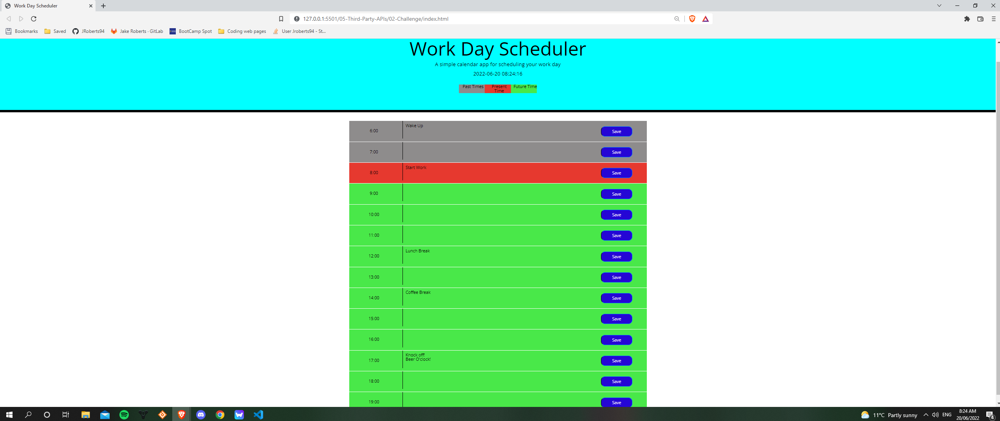

# 05 Third-Party APIs: Work Day Scheduler

## Your Task
This week in our course we have been tasked with creating a 'simple' work day scheduler.
which allows us to view the current date + time, add or remove events on time blocks and save information to our local storage.


## User Story

```md
AS AN employee with a busy schedule
I WANT to add important events to a daily planner
SO THAT I can manage my time effectively
```

## Acceptance Criteria

```md

GIVEN I am using a daily planner to create a schedule
WHEN I open the planner
THEN the current day is displayed at the top of the calendar
WHEN I scroll down
THEN I am presented with timeblocks for standard business hours
WHEN I view the timeblocks for that day
THEN each timeblock is color coded to indicate whether it is in the past, present, or future
WHEN I click into a timeblock
THEN I can enter an event
WHEN I click the save button for that timeblock
THEN the text for that event is saved in local storage
WHEN I refresh the page
THEN the saved events persist
```
 


## Technology Used
HTML
CSS
JavaScript
JQuery
Moment.js
BootStrap


## Links
* [Link to deployed Website](https://jroberts94.github.io/Week5-Work-Day-Scheduler/)
* [Link to github Repository](https://github.com/JRoberts94/Week5-Work-Day-Scheduler)
* 
